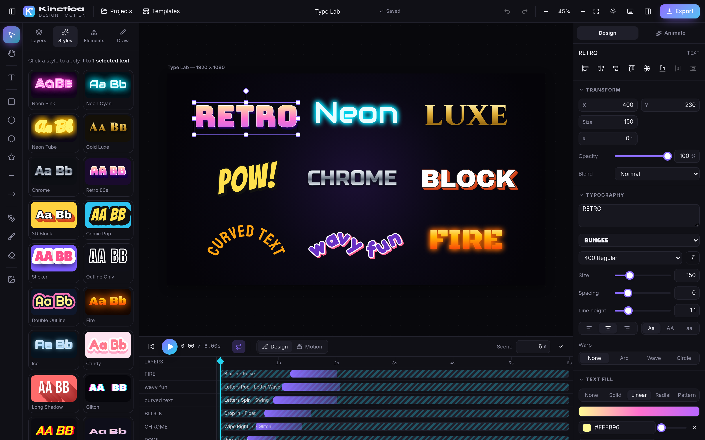
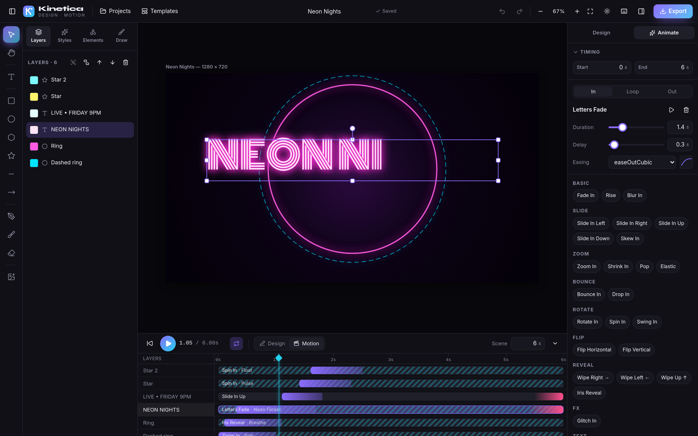

# Kinetica — Design & Motion Studio

A browser-based creative studio for **text design, drawing and animation**. Build social posts, thumbnails, posters and animated clips — then export PNG / JPG / SVG, WebM video or GIF. Everything runs client-side: no account, no backend, no API keys.



## Features

**Canvas editor**
- Artboard presets (Instagram post/portrait/story, YouTube thumbnail, 1080p video, Facebook cover, X post, A4 portrait/landscape, logo) + custom size
- Zoom (Ctrl/⌘ + wheel, pinch), pan (Space-drag, hand tool, wheel), fit-to-screen
- Select / move / resize / rotate (Shift = constrain / keep ratio / 15° snaps), marquee & Shift multi-select
- Smart snapping guides to artboard and other layers (hold Alt to bypass)
- Group / ungroup, align (6 ways) & distribute, layer order, copy / cut / paste / duplicate
- Undo / redo with coalesced slider history, full keyboard shortcuts (press `?`)
- Layers panel with drag-reorder, rename (double-click), lock, hide

**Text**
- 54 Google Fonts (sans, serif, display, script, mono, **Bangla**)
- Size, weight, italic, letter-spacing, line-height, alignment, case
- Fill: solid, linear / radial gradient, built-in patterns, **image fill**
- Outline + second outline, drop shadow, glow / neon, **3D extrude**, RGB glitch split
- Warp: **arc / curved**, **circle**, **wave**
- **41 one-click text styles** rendered with the real engine (neon, chrome, gold, retro 80s, comic, sticker, fire, ice, glitch, holographic, halftone, …)

**Drawing & shapes**
- Pencil, brush, marker, highlighter with size / opacity / smoothing
- Pixel eraser (cuts through artwork beneath), pen tool for straight or smoothed paths, closed shapes
- Rectangle (rounded), ellipse, polygon, star, line, arrow
- Fill / stroke / dash / gradient, 16 blend modes, opacity, shadows & glow on everything
- Image upload (button, drag-drop or paste) with filters: brightness, contrast, saturation, blur, grayscale, sepia, hue, invert + presets

**Animation**
- Per-layer visibility window on a timeline (drag to move, drag edges to trim)
- **86 presets**: 32 entrances, 32 exits, 22 emphasis/loop — fade, slide, zoom, pop, elastic, bounce, drop, rotate, spin, flip, blur, wipe, iris, glitch, typewriter, letter fade / rise / pop / drop / spin / assemble / focus, wave, jump, wiggle, pulse, heartbeat, shake, wobble, swing, float, jello, rubber band, tada, flash, neon flicker, rainbow hue…
- Keyframes for X / Y / scale / rotation / opacity with per-segment easing (29 curves incl. back, elastic, bounce, cubic-bezier); auto-key when you move a layer at the playhead
- Play / pause / scrub, loop, scene duration, Design vs Motion view

**Export & storage**
- PNG (0.5–3×, transparent), JPG, **SVG** (vector, live text)
- **WebM** video via MediaRecorder canvas capture (MP4 on Safari), **GIF** (gifenc)
- Projects auto-save to IndexedDB; JSON project export / import
- 9 animated starter templates

## Develop

```bash
npm install
npm run dev      # http://localhost:5173
npm run lint     # oxlint
npm test         # vitest (easing, keyframes, history, presets, snapping)
npm run build
```

Stack: React 19, TypeScript, Vite, Tailwind CSS v4, Zustand + Immer, custom Canvas 2D renderer, gifenc, idb-keyval, lucide icons.

## Notes

- Video export records in real time — keep the tab visible while recording.
- Image filters use `CanvasRenderingContext2D.filter` (Chrome, Edge, Firefox). Safari may ignore some filters.
- SVG export simplifies eraser strokes and built-in patterns.



## Author

Built by [Mahir Faysal](https://mfaysal.com), a web developer in Bangladesh.

- Project page: [Kinetica on mfaysal.com](https://mfaysal.com/projects/motion-studio)
- More projects: [mfaysal.com/projects](https://mfaysal.com/projects) · Blog: [mfaysal.com/blog](https://mfaysal.com/blog)
